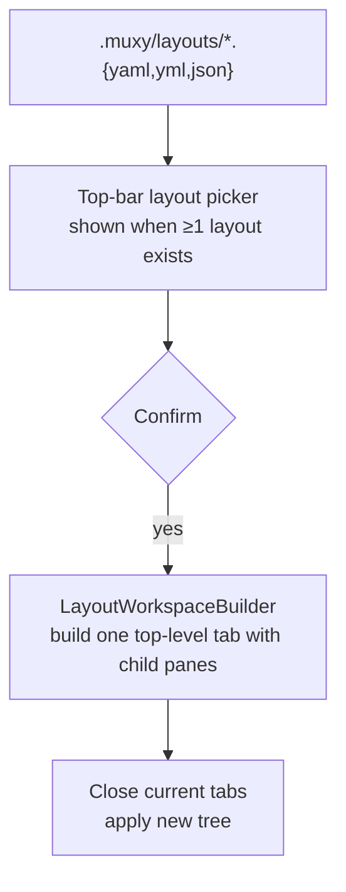

# Layouts Overview

Muxy can apply named in-tab pane layouts to a worktree on demand. Layouts live in-repo under `{Project.path}/.muxy/layouts/` so they can be checked in alongside the project.



## Pages

| Page | What's in it |
| --- | --- |
| [Schema](schema.md) | Fields, single pane, splits, nested splits, JSON form |
| [Examples](examples.md) | Worked examples: single, side-by-side, stacked, tri-row, quad, dev |

## Behavior at a glance

- Each file under `.muxy/layouts/` defines one named layout. The file name (without extension) is the layout's name.
- Supported extensions: `.yaml`, `.yml`, `.json`.
- The first depth-first pane becomes the top-level tab; all remaining panes are its children.
- Docking that top-level tab beside another tab preserves the complete in-tab pane layout.
- Layouts are **never auto-applied** on project open — the user picks one explicitly.
- Selecting a layout asks for confirmation. On accept, all current terminals/tabs in that worktree are closed and the layout is applied.

## File location

```
<project-root>/.muxy/layouts/
  dev.yaml
  release.yaml
  scratch.json
```
